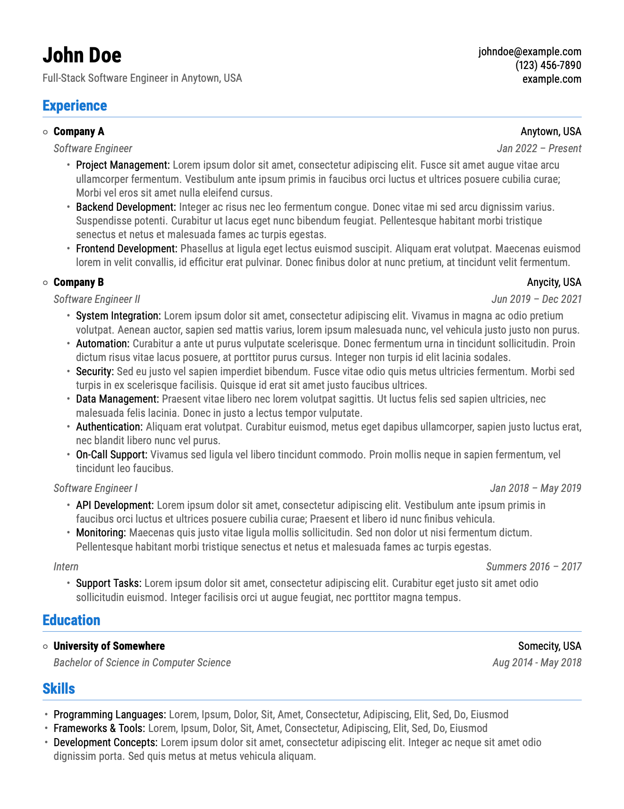

# SWE Resume Template

A clean, modern, and fully customizable LaTeX resume template designed for software engineers, developers, and other tech professionals. Features a professional one-page layout, structured sections for experience, education, and skills, and reusable macros for easy customization. Perfect for anyone who wants a polished, developer-friendly resume that’s ready to publish or share.

## Set up (Docker)

1. Install Docker
2. Start the build service
    ```
    docker compose build
    docker compose up
    ```

## Set up (MacOS)

1. Install BasicTeX
2. Install the necessary dependencies:
    ```
    sudo tlmgr install enumitem
    sudo tlmgr install fontaxes
    sudo tlmgr install latexmk
    sudo tlmgr install roboto
    ```
3. Build the LaTeX project by running `make` or with an extension like [LaTeX Workshop](https://marketplace.visualstudio.com/items?itemName=James-Yu.latex-workshop)

## Screenshot


